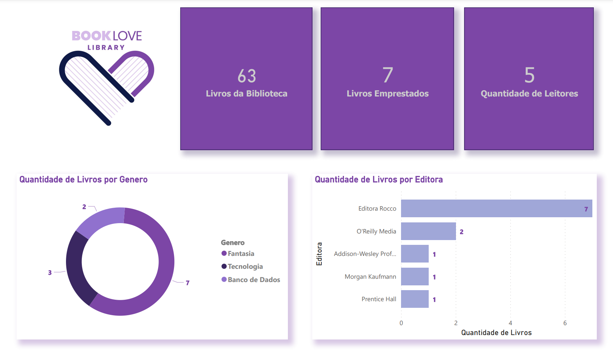
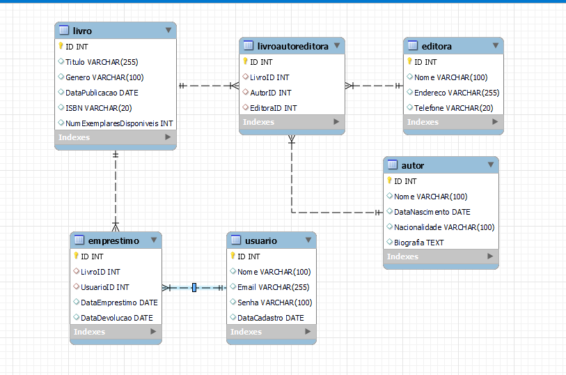

**Readme.md - Biblioteca**



## Descrição

Bem-vindo ao repositório da Biblioteca **BookLove**! Este projeto é um requisito do curso de Formação Web Dev Fullstack - Resilia com o intuito de colocarmos em prática todo conteúdo estudado no módulo 3 do curso.
Biblioteca é um banco de dados construído utilizando MySQL Workbench e para modelagem foi utilizado o dbDiagram, foi desenvolvido para armazenar informações sobre livros, autores e empréstimos em uma biblioteca. Aqui estão as principais informações e instruções para você começar a utilizar o projeto.

## Requisitos

Antes de iniciar, verifique se você possui as seguintes tecnologias instaladas em sua máquina:

- MySQL Workbench (versão 8.0 ou superior)
- PowerBI

## Banco de Dados

O banco de dados utilizado neste projeto é o MySQL. Abaixo estão as tabelas criadas para a implementação:

1. **Livro**: Armazena informações sobre os livros, como título, gênero, data de publicação, ISBN e número de exemplares disponíveis.

2. **Autor**: Contém detalhes sobre os autores dos livros, como nome, data de nascimento, nacionalidade e biografia.

3. **Editora**: Armazena informações das editoras dos livros, como nome, endereço e telefone.

4. **LivroAutorEditora**: Tabela intermediária para relacionar livros, autores e editoras.

5. **Usuario**: Registra os usuários da biblioteca, incluindo nome, email, senha e data de cadastro.

6. **Emprestimo**: Armazena os registros de empréstimos de livros, com informações sobre livro emprestado, usuário, data de empréstimo e data de devolução.

## Modelagem do Banco de Dados

A modelagem do banco de dados foi feita utilizando o **dbDiagram**, um formato simples e intuitivo para representar a estrutura do banco de dados, foi adicionado também o EER (diagrama de relacionamento) criado por engenharia reversa no **MySQL Workbench** Abaixo estam os diagramas com todas as entidades e relacionamentos criados para este projeto:



- Você pode verificar a estrutura e relacionamentos do ***dbdiagram** aqui: [https://dbdocs.io/pry_chu/Projeto-Banco-de-Dados-Biblioteca?schema=public&view=relationships&table=Livro](https://dbdocs.io/pry_chu/Projeto-Banco-de-Dados-Biblioteca?schema=public&view=relationships&table=Livro)

```
Table Livro {
  ID INT [pk]
  Titulo VARCHAR(255)
  Genero VARCHAR(100)
  DataPublicacao DATE
  ISBN VARCHAR(20)
  NumExemplaresDisponiveis INT
}

Table Autor {
  ID INT [pk]
  Nome VARCHAR(100)
  DataNascimento DATE
  Nacionalidade VARCHAR(100)
  Biografia TEXT
}

Table Editora {
  ID INT [pk]
  Nome VARCHAR(100)
  Endereco VARCHAR(255)
  Telefone VARCHAR(20)
}

Table LivroAutorEditora {
  ID INT [pk]
  LivroID INT [ref: > Livro.ID] // Relacionamento com a tabela Livro
  AutorID INT [ref: > Autor.ID] // Relacionamento com a tabela Autor
  EditoraID INT [ref: > Editora.ID]  // Relacionamento com a tabela Editora
}

Table Usuario {
  ID INT [pk]
  Nome VARCHAR(100)
  Email VARCHAR(255)
  Senha VARCHAR(100)
  DataCadastro DATE
}

Table Emprestimo {
  ID INT [pk]
  LivroID INT [ref: > Livro.ID] // Relacionamento com a tabela Livro
  UsuarioID INT [ref: > Usuario.ID] // Relacionamento com a tabela Usuário
  DataEmprestimo DATE
  DataDevolucao DATE
}
```
## Como utilizar o projeto?

Para começar a utilizar a Biblioteca, siga os passos abaixo:

1. Clone o repositório para sua máquina local:
```bash
git clone https://github.com/SuayMack/DBBiblioteca.git
```

2. Certifique-se de ter o MySQL Workbench instalado e o servidor MySQL ativo.

3. Execute o script SQL fornecido no arquivo `db_biblioteca.sql` para criar o banco de dados e as tabelas.

4. Pronto! Agora você está pronto para executar a aplicação e começar a armazenar informações sobre livros e autores em sua biblioteca.

## Preenchimento das Tabelas

Para garantir a funcionalidade e testar o banco de dados, foram inseridos registros nas tabelas. Cada tabela possui pelo menos 5 registros, o que permite uma melhor avaliação do funcionamento da aplicação.
Você pode verificar o código para inserir dados na tabela no arquivo `populando_db_biblioteca.sql`.

## Criação do Gráfico no PowerBI

O Power BI é uma poderosa ferramenta de análise de dados que permite criar visualizações interativas e informativas, como gráficos, tabelas e relatórios, a partir de fontes de dados diversas. Construir um gráfico no Power BI é uma tarefa simples e intuitiva, e pode ser feito em poucos passos:

1. Importar dados: Na opção "Obter Dados" da barra de ferramentas e selecionar a fonte de dados desejada. Nesse caso, foi utilizado a opção:

  - Banco de dados MySQL
  - Nome do Servidor
  - Nome da Biblioteca

2. Escolher o tipo de gráfico: Foi utilizado uma [imagem]: [Freepik.com](Freepik.com), 3 cards, um gráfico de rosca e um gráfico de barras;

3. Selecionar os dados;

4. Customizar a aparência: É possível alterar cores, fontes, títulos, legendas e outros elementos visuais para tornar o gráfico mais atrativo e compreensível.

5. Interatividade: O Power BI permite criar gráficos interativos que respondem às seleções feitas pelo usuário. É possível criar filtros, slicers e outras interações que permitem explorar os dados de forma dinâmica.

6. Salvar e compartilhar: Você pode salvar seu trabalho e compartilhar suas visualizações com outras pessoas, aqui você tem o arquivo em **PDF** , em arquivo do tipo **Modelo PowerBI** .

Construir gráficos no Power BI é uma maneira poderosa de transformar dados em insights significativos, permitindo tomar decisões informadas e embasadas em análises visuais. Com a facilidade de uso e a variedade de opções disponíveis, o Power BI se torna uma ferramenta essencial para profissionais e empresas que desejam explorar e comunicar dados de forma eficiente.

## Referências

- Documentação do MySQL Workbench: [https://dev.mysql.com/doc/workbench/en/](https://dev.mysql.com/doc/workbench/en/)
- Documentação do dbDiagram: [https://dbdiagram.io/d](https://dbdiagram.io/d)
- Livros: [https://www.amazon.com.br/](https://www.amazon.com.br/)
- ChatGPT: [https://chat.openai.com/](https://chat.openai.com/)
- PowerBI: [https://powerbi.microsoft.com/](https://powerbi.microsoft.com/)

Feito com 💜 por Priscila Chueryz